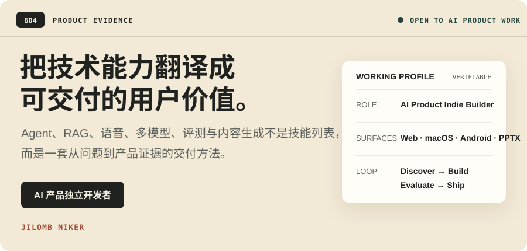
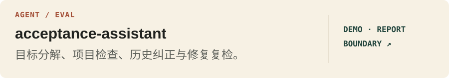
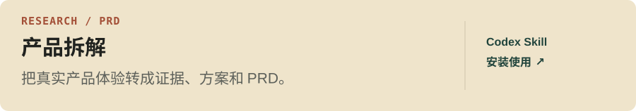
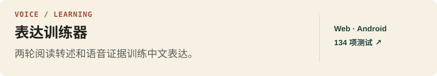
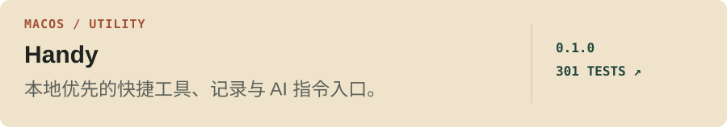
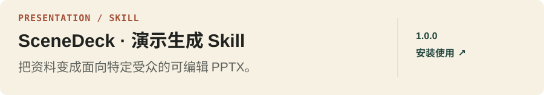
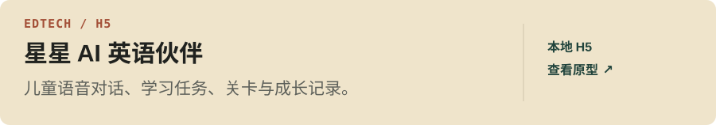
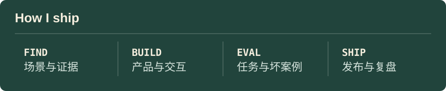

  

  <a href="https://github.com/jilombmiker-alt?tab=repositories"><strong>查看全部公开仓库</strong></a>
  &nbsp;·&nbsp;
  <a href="mailto:jilombmiker@gmail.com"><strong>联系我</strong></a>

## 用项目回答“你具体做过什么”

每个作品都尽量说明：为什么值得做、我交付了什么、如何验证，以及目前还有哪些限制。

   
   
   
   
   
  

  

  <strong>Build the product. Test the boundary. Leave the proof.</strong>

